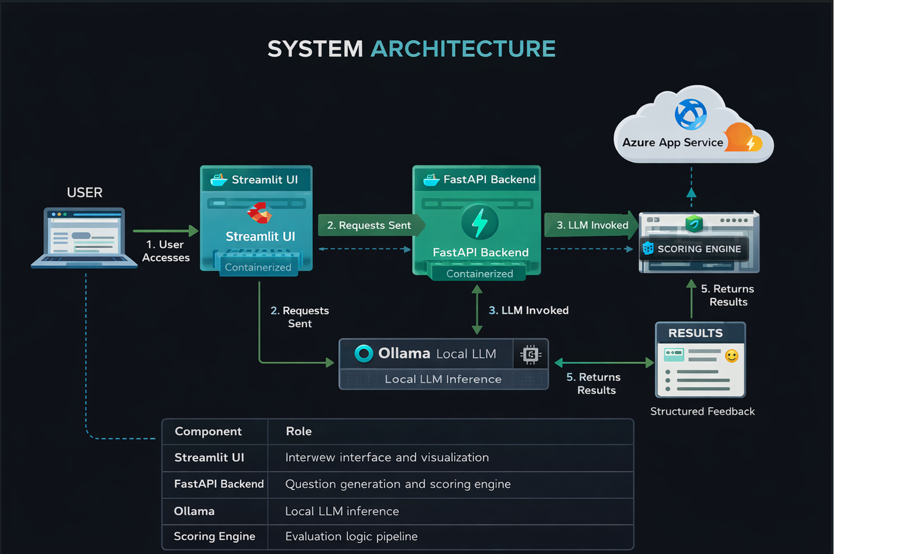

# 🤖 AI Interview Coach

<p align="center">
  <a href="https://app.ai-coach-lab.com">
    
  </a>
  
  
  
  
  
  
</p>

> **AI-powered interview practice platform for AI Developers and LLM Engineers.**  
> Generates role-based technical questions, evaluates answers using hybrid scoring, and provides structured coaching — all running locally with Ollama (no paid APIs).

🔗 **Live App:** https://app.ai-coach-lab.com  
📡 **Status:** ✓ Online & Secure (TLS)  
🧱 **Stack:** Python · FastAPI · Streamlit · Ollama · Docker · Azure App Service

## 📌 Overview

AI Interview Coach simulates real technical interviews for:

- AI Engineers
- LLM Application Developers
- Data & ML Engineers

The platform provides:

- Dynamically generated technical questions
- Answer evaluation using deterministic + LLM hybrid scoring
- Structured coaching feedback
- Performance classification (Junior / Mid / Senior)

All LLM inference runs **locally via Ollama**, enabling privacy-safe and cost-free usage.

## 🎯 Purpose of the Project

✔ Demonstrates production-ready LLM application design  
✔ Shows hybrid evaluation logic (rule-based + semantic scoring)  
✔ Full Dockerized deployment to Azure  
✔ Clean separation of UI and API services  
✔ Excellent interview and hiring portfolio project 🎓💼

## 🎮 Application Features

| Feature | Description |
|--------|------------|
| 🎯 Role-Based Questions | Junior / Mid / Senior / Mixed difficulty |
| ⚙️ Local LLM Inference | Ollama-hosted models, no external APIs |
| 📊 Hybrid Scoring Engine | Rule-based + LLM semantic grading |
| 🧠 Structured Coaching | JSON-based feedback parsing |
| 📈 Performance Summary | Per-question + overall scoring |
| 🔁 Randomized Question Sets | Prevents repeated prompts |

## 🧩 Architecture Overview

The system uses a two-service architecture separating UI and evaluation logic.

### 🌐 Production Architecture (Azure App Service)

<p align="center">
  
</p>

**Flow**

1. User accesses Streamlit UI in browser  
2. UI sends requests to FastAPI backend  
3. FastAPI invokes Ollama locally for LLM inference  
4. Scoring engine evaluates answers and returns structured feedback  

| Component | Role |
|--------|------|
| **Streamlit UI** | Interview interface and visualization |
| **FastAPI API** | Question generation and scoring engine |
| **Ollama Runtime** | Local LLM inference |
| **Docker Containers** | Service isolation and deployment |
| **Azure App Service** | Public hosting of containerized services |

## 🧠 How Scoring Works (Technical Design)

The evaluation pipeline combines deterministic validation with LLM semantic grading to reduce hallucination bias and increase consistency.

### 1. Concept Rubric Mapping

Each question defines:
- Required technical concepts
- Optional advanced concepts

This acts as a deterministic baseline.

### 2. Rule-Based Validation Layer

The system checks for:
- Keyword presence
- Concept mentions
- Structural completeness

Answers failing basic requirements cannot score highly regardless of phrasing quality.

### 3. LLM Semantic Assessment

Answer, rubric, and instructions are sent to Ollama with enforced JSON schema:

```json
{
  "score": 0-100,
  "strengths": [],
  "missing_concepts": [],
  "improvements": []
}

