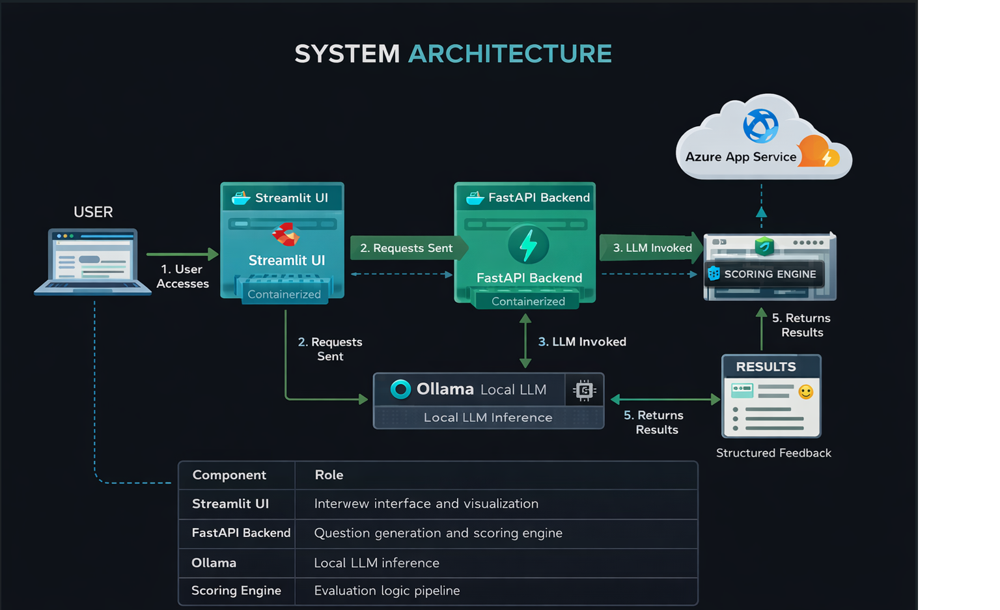

# 🤖 AI Interview Coach

<p align="center">
  <a href="https://app.ai-coach-lab.com">
    
  </a>
  
  
  
  
  
  
</p>

> **AI-powered interview practice platform for AI Developers, LLM Engineers, and ML practitioners.**  
> Generates role-based technical questions, evaluates answers with a hybrid scoring pipeline, and delivers structured coaching feedback through a production-style UI and API architecture.

🌐 Live Deployment

- UI: https://crb-ai-interview-coach.streamlit.app
- API: https://api.ai-coach-lab.com
- API Docs: https://api.ai-coach-lab.com/docs

## 📌 Overview

AI Interview Coach simulates realistic technical interviews for:

- AI Engineers
- LLM Application Developers
- Data & Machine Learning Engineers

The platform provides:

- Dynamically generated technical questions
- Hybrid answer evaluation using deterministic checks and LLM-based semantic review
- Structured coaching feedback
- Performance classification aligned to Junior / Mid / Senior expectations

All LLM inference runs locally through **Ollama**, which supports privacy-aware and cost-conscious experimentation without relying on paid inference APIs.

## 🎯 Project Purpose

This project was built to demonstrate:

- Production-style LLM application design
- Hybrid evaluation logic combining deterministic scoring with semantic assessment
- Clean separation between UI and backend services
- Dockerized deployment to Azure App Service
- A portfolio-ready AI product with practical user value

## 🎮 Core Features

| Feature | Description |
|--------|------------|
| 🎯 Role-Based Questions | Junior / Mid / Senior / Mixed difficulty interview prompts |
| ⚙️ Local LLM Inference | Ollama-hosted models with no paid external API dependency |
| 📊 Hybrid Scoring Engine | Deterministic baseline checks + LLM semantic evaluation |
| 🧠 Structured Coaching | JSON-based coaching feedback parsing and display |
| 📈 Performance Summary | Per-question and overall scoring feedback |
| 🔁 Randomized Question Sets | Reduces repetitive prompt patterns across sessions |

## 🧩 Architecture Overview

The application uses a two-service architecture that separates the interview interface from the evaluation engine.

<p align="center">
  <a href="docs/img/ai-interview-coach/architecture.png">
    
  </a>
</p>

### Request Flow

1. User interacts with the Streamlit UI in the browser  
2. The UI sends requests to the FastAPI backend  
3. FastAPI processes question generation and answer evaluation  
4. Ollama performs local LLM inference for semantic assessment  
5. Structured scoring and coaching feedback are returned to the UI  

| Component | Role |
|--------|------|
| **Streamlit UI** | Interview experience and results visualization |
| **FastAPI API** | Question generation, scoring, and orchestration |
| **Ollama Runtime** | Local LLM inference |
| **Docker Containers** | Service packaging and deployment consistency |
| **Azure App Service** | Public hosting for the containerized application |

## 🧠 How Scoring Works

AI Interview Coach uses a **hybrid evaluation pipeline** designed to balance **consistency** and **semantic understanding**.

### Why Hybrid Scoring Matters

- Pure LLM grading can drift across runs
- Pure keyword scoring can miss valid answers phrased differently
- A hybrid approach provides a repeatable baseline plus semantic validation

### 1. Rubric to Concept Map

Each question includes a rubric with:

- **Required concepts**
- **Optional or advanced concepts**
- Possible misconceptions where relevant

This rubric becomes the ground-truth reference for evaluation.

### 2. Deterministic Validation Layer

Before semantic grading, the system checks:

- Concept coverage
- Minimum completeness
- Basic structural quality when reasoning is expected

This layer reduces the chance of vague but polished answers receiving inflated scores.

### 3. LLM Semantic Assessment

The backend sends the following to Ollama:

- the question
- the rubric
- the user answer
- strict instructions to return JSON in a fixed schema

The LLM then evaluates:

- technical correctness
- reasoning quality
- concept accuracy
- clarity and depth

Example response format:

```json
{
  "score": 0,
  "strengths": [],
  "missing_concepts": [],
  "improvements": []
}
